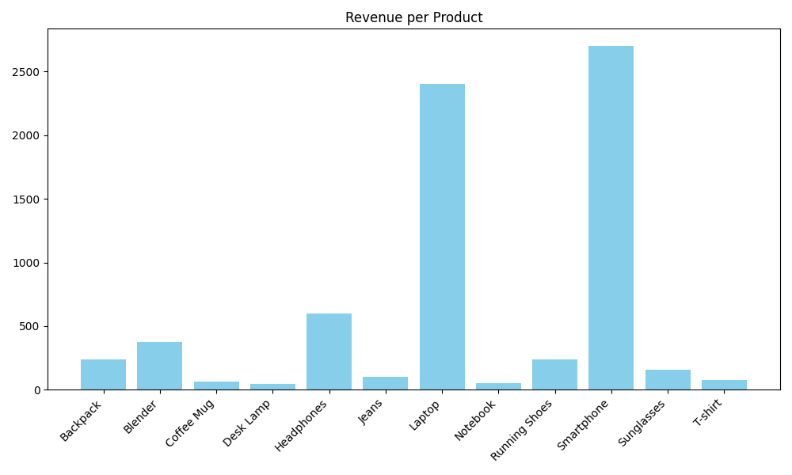
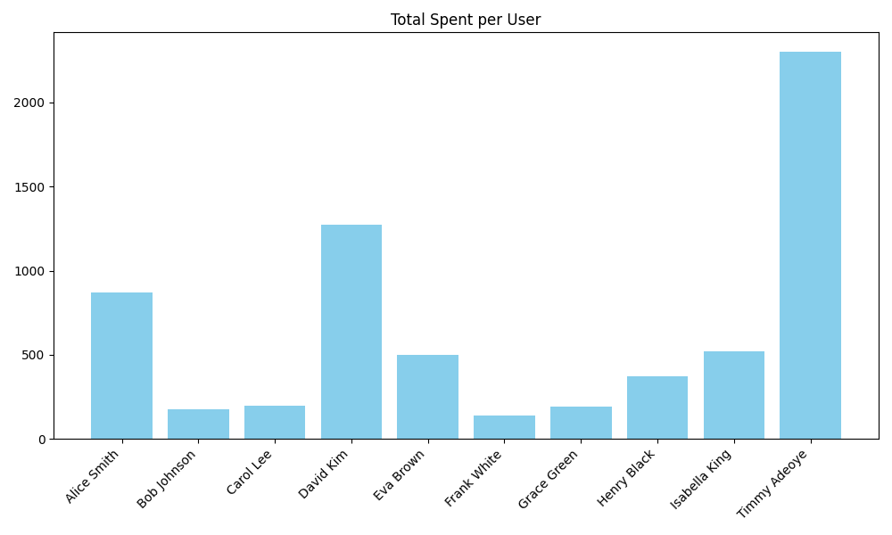
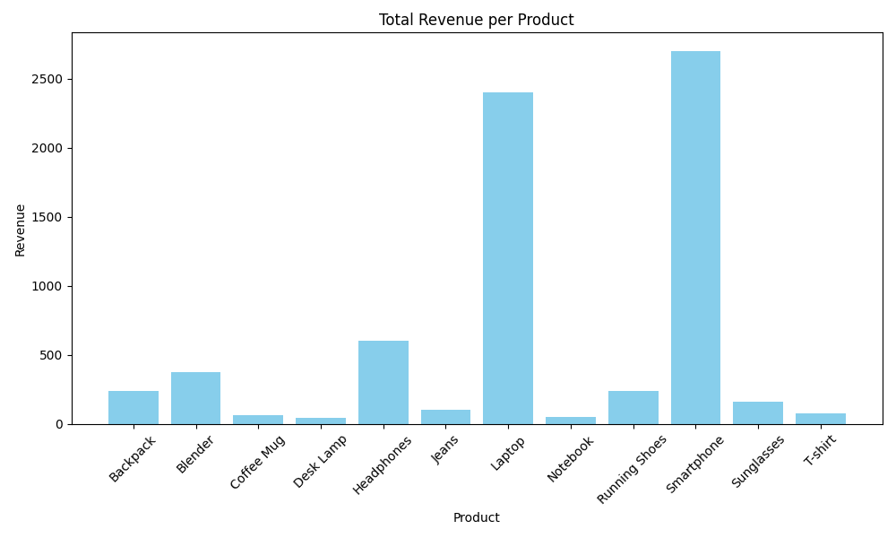

# MockAmazon – E-commerce Backend & Analytics Project

## Clarifications

POST Requests are used to store/submit data, on the contrary GET requests tends to retrieve information.

## Project Overview

**MockAmazon Fullstack/Backend-Data Project**
MockAmazon is a small e-commerce platform for purchasing amazing Seeds. It demonstrates skills in:

* DBMS: MySQL (users, products, orders, order_items)
* Backend code: Python + SQLAlchemy
* Data analysis: Pandas, NumPy
* Visualisation: Matplotlib Revenue & User Spending charts
* Optional API: FastAPI endpoints for live analytics (not yet implemented)

This is a great project for data analyst or backend developer portfolios.

## Features

* Database on MySQL with real world e-commerce tables
* Python script `analytics/run_analytics.py` that:

  * Data retrieval from the database is done on these.
  * Calculates revenue per product
  * Computes all out spend per user
  * Exports CSVs for more analysis
  * Generates visual charts automatically
  * Optionally: FastAPI API endpoints to get analytics in real time (future improvement)

## Tech Stack

| Layer             | Technology                                                                        |             |
| ----------------- | --------------------------------------------------------------------------------- | ----------- |
| Database          | MySQL                                                                             |             |
| Backend           | Python- SQLAlchemy- The codebase uses more SQL< than you'd find in most services. |             |
| API               | FastAPI (optional)                                                                |             |
| Data manipulation | Pandas, NumPy                                                                     |             |
| Visualization     | Matplotlib                                                                        |             |
| Environment       | VS Code                                                                           | python venv |

## Getting Started

###  Clone the Repository

```bash
git clone https://github.com/TimiZA1122/MockAmazon.git
cd MockAmazon
```

###  Prepare Python Environment

```bash
python3 -m venv venv
source venv/bin/activate # Mac/Linux
# OR
venv\Scripts\activate # Windows
pip install -r requirements.txt
```

###  Set Up the Database

Start MySQL:

```bash
brew services start mysql # For MAC users you can try this!
```

Log in:

```bash
mysql -u root -p
```

Create the database:

```sql
CREATE DATABASE mock_amazon;
USE mock_amazon;
```

Create tables (or import the example SQL dump):

```sql
CREATE TABLE users (...);
CREATE TABLE products (...);
CREATE TABLE orders (...);
CREATE TABLE order_items (...);
```

Add Sample Data (Not Mandatory, but Recommended):

```sql
INSERT INTO users (...) SELECT...;
INSERT INTO products (...) VALUES (... );
INSERT INTO orders .. VALUES (...);
INSERT INTO order_items (…) VALUES (…);
```

### Configure Python Connection

In `analytics/run_analytics.py`:

```python
DB_USER = "root"
DB_PASSWORD = "zackTimmy678#"
DB_HOST = "127.0.0.1"
DB_NAME = "mock_amazon"
```

###  Run Analytics

```bash
python analytics/run_analytics.py
```

What happens:

* CSV outputs stored in: `analytics/outputs/`
* Charts generated automatically (revenue per product, total spent per user)
* Excel/Google Sheets compatible CSVs and also support for viewing charts directly


```bash
uvicorn main:app --reload
```

* You can use interactive API docs (swagger) by going to `http://127.0.0.1:8000/docs`.
* Try endpoints like `/top-products`, `/user-sales`, or `/low-stock`.

## Project Output Examples

* CSV: Revenue by item, purchase history for users
* Charts:

  * Bar graph of product revenue
  * Bar chart of total spent / user

## Charts

### Revenue per Product



### Total Spent per User



### Total Revenue per Product


